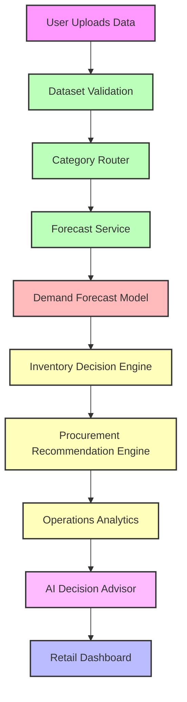

# AI Retail Inventory Decision Intelligence Platform

## System Architecture Overview

The **AI Retail Inventory Decision Intelligence Platform** is structured conceptually as a modern SaaS AI analytics product. To ensure scalability, maintainability, and clear separation of concerns, the system is divided into five logical service layers:

1. **Presentation Layer**
2. **Application Layer**
3. **Analytics Layer**
4. **AI Reasoning Layer**
5. **Model Layer**

---

## 1. Presentation Layer
**Responsibility:** User Interaction & Experience

This layer manages all user interfaces, visualizations, and input collections.
- **Directory:** `ui/`
  - `dashboard.py`
  - `product_views.py`
- **Key Functions:**
  - Dataset upload handling
  - Rendering dashboard display and charting visualizations
  - AI conversational assistant interface
  - Scenario simulation controls
- **Framework:** Streamlit

## 2. Application Layer
**Responsibility:** Workflow Orchestration

This layer handles the complex execution pipelines, controlling how data moves between services from initial upload to final visualization.
- **Directory:**
  - `routing/` (e.g., `category_router.py`)
  - `services/` (e.g., `forecast_service.py`)
- **Key Functions:**
  - Dataset validation and parsing
  - Category routing (e.g., sending items to Grocery, Household, or Hobbies models)
  - Product-level orchestration
  - Coordinating analytics modules
- **Pipeline Flow:**
  `Upload Dataset` → `Validation` → `Category Routing` → `Forecast Service` → `Analytics Engine` → `AI Advisor` → `Dashboard Output`

## 3. Analytics Layer
**Responsibility:** Decision Calculations

This layer executes the deterministic business logic and operational mathematics of the platform.
- **Directory:**
  - `decision/` (e.g., `reorder_engine.py`, `procurement_engine.py`)
  - `analytics/` (e.g., `operations_dashboard.py`)
- **Key Functions:**
  - Reorder point calculation
  - Safety stock estimation
  - Procurement planning
  - Risk evaluation
  - Calculating aggregated operational metrics

## 4. AI Reasoning Layer
**Responsibility:** LLM-Based Insights

This layer provides conversational interfaces and natural language interpretations of the system's analytics, while strictly adhering to grounded data. It explains the analytics but *never* changes the underlying deterministic outputs.
- **Directory:** `ai/`
  - `decision_advisor.py`
  - `conversation_assistant.py`
  - `ai_service.py`
- **Key Functions:**
  - Generating grounded LLM explanations
  - Managing conversational analytics loops
  - Providing decision reasoning and operational advice

## 5. Model Layer
**Responsibility:** Predictive Modeling

This layer handles the core Machine Learning engine of the platform, executing the deep learning algorithms to predict future demand and estimate confidence intervals.
- **Directories:**
  - `models/` (e.g., `grocery_model.pth`, `household_model.pth`, `hobbies_model.pth`)
  - `scalers/` (e.g., `grocery_scaler.pkl`, `household_scaler.pkl`, `hobbies_scaler.pkl`)
- **Key Functions:**
  - Loading ML models and scalers via `services/forecast_service.py`
  - Preprocessing input features
  - Running multivariate LSTM forecasts
  - Generating prediction intervals for uncertainty analysis

---

## Data Flow Diagram

---

## Technology Stack

### Machine Learning
- **PyTorch:** Multivariate LSTM forecasting models and tensor operations

### Backend
- **FastAPI:** Core backend routing (where applicable to future service separation)

### Frontend
- **Streamlit:** Rapid UI deployment for dashboarding and interaction

### AI Reasoning
- **ChatGPT / Gemini API:** Powering the Conversational retail analytics assistant (`google.generativeai`)

### Data Processing
- **Pandas / NumPy:** Fast vectorization, data manipulation, and calculation rules

### Visualization
- **Matplotlib / Plotly / Altair:** Rendering complex datasets into understandable charts

---

*This architecture document establishes the **AI Retail Inventory Decision Intelligence Platform** as an enterprise-grade SaaS analytics suite seamlessly blending deep learning forecasting with generative AI insights.*
